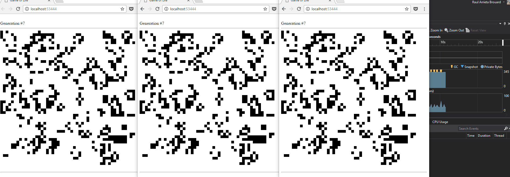
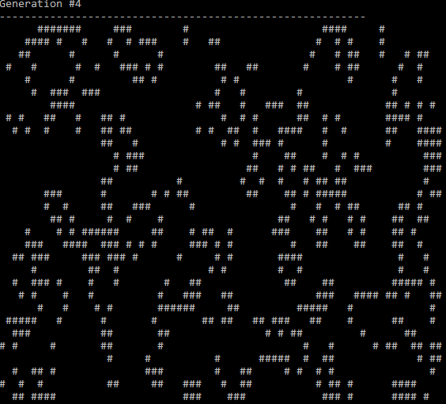

# nehola.gameoflife
## Description
nehola.gameoflife is a simple implementation of the [Conway's Game of Life](https://en.wikipedia.org/wiki/Conway%27s_Game_of_Life).

The code sucks.

## Projects
### nehola.gameoflife.entities
Class Library (.NET Core) - Life logic.

### nehola.gameoflife.webapp
ASP.NET Core Web Application using SignalR to notify clients new generations.

### nehola.gameoflife.consoleapp
Console Application (.NET Core)

License

Code released under the [MIT license](LICENSE).

